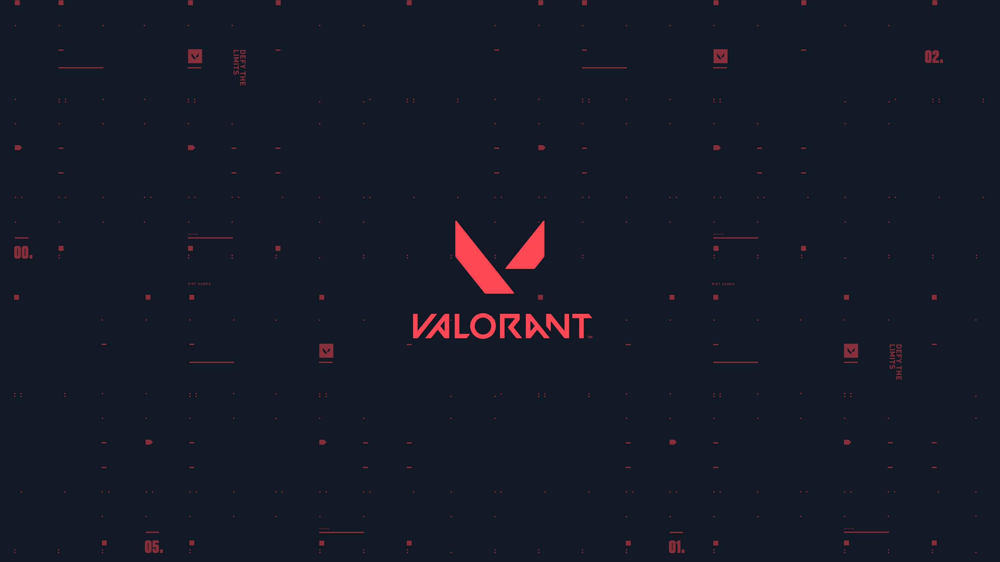

# API Valorant - Aplicación Web Multiplataforma

Una aplicación web moderna desarrollada con **Astro** que integra múltiples APIs y funcionalidades de e-commerce, diseñada para demostrar competencias técnicas en desarrollo full-stack.



## 📋 Descripción del Proyecto

Aplicación web que combina:
- **Consumo de APIs**: Valorant, Rick and Morty, Dummy JSON
- **E-commerce completo**: Gestión de productos, categorías y usuarios
- **Sistema de autenticación**: JWT con roles de usuario y administrador
- **Integración de pagos**: Webpay Plus de Transbank
- **Interfaz moderna**: Diseño responsivo con Tailwind CSS

## 🛠️ Stack Tecnológico

### Frontend
- **Astro 5.1.5** - Framework principal para desarrollo web moderno
- **React 19.0.0** - Biblioteca para componentes interactivos
- **TypeScript 5.7.2** - Tipado estático para mayor robustez
- **Tailwind CSS 3.4.16** - Framework de estilos utilitarios
- **NextUI 2.6.10** - Biblioteca de componentes UI moderna
- **Framer Motion 11.15.0** - Animaciones fluidas y transiciones

### Backend & Base de Datos
- **Astro DB 0.14.5** - Base de datos integrada
- **Drizzle ORM** - ORM moderno para TypeScript
- **Lucia Auth** - Sistema de autenticación seguro

### Autenticación & Seguridad
- **JWT (JSON Web Tokens)** - Manejo de sesiones
- **BCrypt.js** - Encriptación de contraseñas
- **Arctic 1.2.1** - Proveedores OAuth
- **Oslo 1.2.1** - Utilidades de seguridad

### Integración de Pagos
- **Transbank SDK 5.0.0** - Webpay Plus para pagos online

### Herramientas de Desarrollo
- **React Router DOM 7.1.1** - Navegación del lado del cliente
- **JWT Decode 4.0.0** - Decodificación de tokens
- **Astro Check** - Verificación de tipos y errores

### Deployment
- **Netlify Adapter** - Optimizado para despliegue en Netlify

## 🏗️ Arquitectura del Proyecto

```text
/
├── public/                    # Archivos estáticos
│   ├── favicon.svg
│   └── *.jpeg                # Imágenes de productos
├── src/
│   ├── assets/               # Recursos multimedia
│   ├── components/           # Componentes reutilizables
│   │   ├── store/           # Componentes del e-commerce
│   │   ├── valorant/        # Componentes API Valorant
│   │   ├── rickandmorty/    # Componentes API Rick & Morty
│   │   ├── webpay/          # Integración de pagos
│   │   └── dummy/           # Componentes datos dummy
│   ├── layouts/             # Layouts base
│   ├── pages/               # Rutas de la aplicación
│   │   ├── api/            # Endpoints API
│   │   ├── node/           # Páginas del e-commerce
│   │   ├── valorant/       # Páginas API Valorant
│   │   └── rickandmorty/   # Páginas Rick & Morty
│   ├── utils/              # Funciones utilitarias
│   ├── auth.ts             # Configuración autenticación
│   └── middleware.ts       # Middleware de rutas
├── db/                     # Configuración base de datos
├── astro.config.mjs       # Configuración Astro
└── tailwind.config.mjs    # Configuración Tailwind
```

## ⚡ Funcionalidades Principales

### 🎮 APIs Integradas
- **Valorant API**: Agentes, armas, mapas, rangos competitivos
- **Rick and Morty API**: Personajes, episodios, ubicaciones con filtros
- **Dummy JSON API**: Productos de ejemplo con paginación

### 🛒 Sistema E-commerce
- **CRUD completo** de productos y categorías
- **Gestión de inventario** con control de stock
- **Sistema de usuarios** con roles (usuario/administrador)
- **Carrito de compras** funcional
- **Integración Webpay** para pagos reales

### 🔐 Autenticación & Autorización
- **Registro/Login** con validación de formularios
- **JWT Tokens** para manejo de sesiones
- **Middleware de protección** de rutas
- **Roles de usuario** con permisos diferenciados

### 💳 Procesamiento de Pagos
- **Webpay Plus** integración completa
- **Transacciones seguras** con Transbank
- **Confirmación de pagos** automática
- **Historial de compras**

### 🎨 Interfaz de Usuario
- **Diseño responsivo** mobile-first
- **Componentes modernos** con NextUI
- **Animaciones suaves** con Framer Motion
- **Tema dark** con colores Valorant

## 🛠️ Comandos de Desarrollo

Todos los comandos se ejecutan desde la raíz del proyecto:

| Comando                   | Acción                                           |
| :------------------------ | :----------------------------------------------- |
| `npm install`             | Instala las dependencias del proyecto           |
| `npm run dev`             | Inicia servidor de desarrollo en `localhost:4321` |
| `npm run build`           | Construye el sitio para producción en `./dist/`  |
| `npm run preview`         | Previsualiza la build localmente                |
| `npm run astro ...`       | Ejecuta comandos CLI como `astro add`, `astro check` |
| `npm run astro -- --help` | Obtiene ayuda usando el CLI de Astro            |

## 🚀 Instalación y Configuración

1. **Clonar el repositorio**
```bash
git clone <repository-url>
cd api-valorant
```

2. **Instalar dependencias**
```bash
npm install
```

3. **Configurar variables de entorno**
```bash
# Crear archivo .env
cp .env.example .env
# Agregar claves API necesarias
```

4. **Configurar base de datos**
```bash
npm run db:push
npm run db:seed
```

5. **Iniciar desarrollo**
```bash
npm run dev
```

## 📊 Competencias Técnicas Demostradas

### Desarrollo Frontend
- ✅ **Astro/React**: Componentes híbridos SSR/CSR
- ✅ **TypeScript**: Tipado estático y desarrollo escalable
- ✅ **Responsive Design**: Móvil-first con Tailwind CSS
- ✅ **Component Library**: Integración NextUI
- ✅ **Animaciones**: Framer Motion para UX mejorada

### Desarrollo Backend
- ✅ **API Integration**: Consumo múltiples APIs REST
- ✅ **Database Design**: Esquemas con Drizzle ORM
- ✅ **Authentication**: JWT + bcrypt implementación segura
- ✅ **Middleware**: Protección rutas y validaciones
- ✅ **File Upload**: Manejo archivos e imágenes

### DevOps & Tools
- ✅ **Git**: Control de versiones con buenas prácticas
- ✅ **Build Process**: Optimización para producción
- ✅ **Deployment**: Configuración Netlify
- ✅ **Package Management**: NPM y dependencias

### Integración de Terceros
- ✅ **Payment Gateway**: Webpay Plus Transbank
- ✅ **External APIs**: Valorant, Rick & Morty
- ✅ **Image Optimization**: Lazy loading y responsive images
- ✅ **SEO**: Meta tags y estructura semántica

## 🔗 APIs Utilizadas

| API | Endpoint | Uso |
|-----|----------|-----|
| Valorant API | `valorant-api.com` | Datos juego Valorant |
| Rick and Morty | `rickandmortyapi.com` | Personajes y episodios |
| Dummy JSON | `dummyjson.com` | Productos de prueba |
| Transbank Webpay | `webpay.transbank.cl` | Procesamiento pagos |

## 📱 Características Responsivas

- **Mobile First**: Diseño optimizado para móviles
- **Tablet**: Layout adaptativo para tablets
- **Desktop**: Experiencia completa en escritorio
- **Touch Friendly**: Interfaz táctil optimizada

## 🔒 Seguridad Implementada

- **Autenticación JWT**: Tokens seguros con expiración
- **Validación Frontend/Backend**: Doble validación
- **Encriptación Contraseñas**: BCrypt hashing
- **Protección CSRF**: Tokens de validación
- **Sanitización Inputs**: Prevención XSS

## 📈 Optimizaciones de Performance

- **Code Splitting**: Carga lazy de componentes
- **Image Optimization**: WebP y lazy loading
- **Minificación**: CSS/JS optimizado
- **Caching**: Estrategias de cache del navegador
- **Bundle Size**: Análisis y optimización

## 💼 Para Analista Programador

Este proyecto demuestra competencias esenciales para un **Analista Programador**:

### Análisis y Diseño
- Arquitectura modular y escalable
- Patrones de diseño implementados
- Documentación técnica completa
- Casos de uso bien definidos

### Programación
- Clean Code y buenas prácticas
- Testing y validaciones
- Manejo de errores robusto
- Optimización de performance

### Integración
- APIs REST múltiples
- Bases de datos relacionales
- Sistemas de pago externos
- Servicios de terceros

## � Contacto y Enlaces

- **Desarrollador**: [Tu Nombre]
- **Email**: [tu.email@ejemplo.com]
- **LinkedIn**: [tu-perfil-linkedin]
- **Portfolio**: [tu-portfolio.com]

## 📝 Notas para Reclutadores

Este proyecto representa un **portfolio técnico completo** que demuestra:

1. **Versatilidad Técnica**: Múltiples tecnologías modernas
2. **Pensamiento Analítico**: Arquitectura bien estructurada
3. **Experiencia Práctica**: Funcionalidades reales de e-commerce
4. **Atención al Detalle**: UI/UX cuidadosamente diseñada
5. **Capacidad de Integración**: APIs y servicios externos

### Próximos Desarrollos
- [ ] Testing unitario con Jest/Vitest
- [ ] PWA con Service Workers
- [ ] Dashboard de analytics
- [ ] API GraphQL personalizada
- [ ] Implementación Docker

---

**¿Interesado en saber más?** No dudes en contactar para una demostración en vivo del proyecto.
